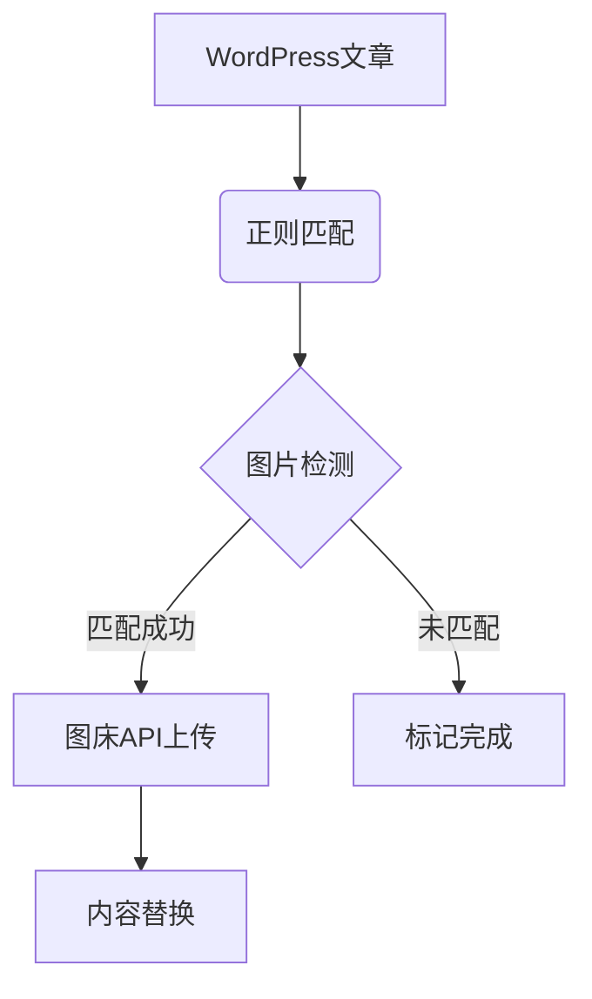

以下是专为“聚合图床 Pro”插件设计的GitHub仓库介绍页模板，结合代码特性和最佳实践：

---
# 聚合图床 Pro 🚀
**WordPress图片托管与替换解决方案**  
 


## 核心功能 🔥
1. **智能检测替换**  
   正则表达式驱动的内容扫描引擎，支持多域名白名单配置（`www.baidu.com`等）
   
2. **多平台对接**  
   深度集成聚合图床API，支持：
   - 自动图片水印生成
   - 相册分类管理
   - 超时重试机制（默认10秒）

3. **高性能处理**  
   ```php
   define('XIR_PER_PAGE', 20); // 批量处理20篇文章/批次
   define('XIR_REGEX_CACHE_KEY', 'xianzhidaquan'); // 正则表达式缓存优化
   ```

4. **可视化进度监控**  
   包含成功率统计、剩余任务量预测等关键指标

---

## 快速开始 🚀
### 安装步骤
1. 克隆仓库到WordPress插件目录：
   ```bash
   sudo git clone https://github.com/212516132/image-replacer-pro /var/www/html/wp-content/plugins/image-replacer-pro
   ```
2. 在WordPress后台激活插件

### 配置指南
通过 **设置 → 图片替换设置** 配置：
- 🔑 API Token：从聚合图床获取的访问凭证
- 🌐 目标域名：需要替换的图片源域名（多域名用逗号分隔）
- 🖼️ 水印设置：启用/禁用自动水印功能
- 📁 相册分类：指定图片存储目录

---

## 技术架构 ⚙️
### 核心模块
| 模块 | 技术实现 | 性能指标 |
|------|---------|---------|
| 正则引擎 | PCRE预编译模式 | 缓存时间：7天 |
| 图片处理 | cURL多线程传输 | 超时：10秒 |
| 任务调度 | WP Cron + AJAX | 吞吐量：20篇/批次 |

### 扩展能力


---

## 贡献指南 👥
欢迎通过以下方式参与项目：
1. 提交PR改进正则表达式匹配逻辑
2. 补充多语言文档（当前支持中文）
3. 扩展支持更多图床平台

请先阅读[贡献者公约](CONTRIBUTING.md)

---

## 许可证 📜
[GPLv3](LICENSE) © 2025 小小随风

> 注：本README采用GitHub Flavored Markdown标准，部分特性参考了awesome-github-profile-readme的最佳实践

---

### 参考资料
: Markdown语法指南  
: Awesome Profile模板库  
: GitHub Pages设置规范  
: GitHub Pages高级功能
